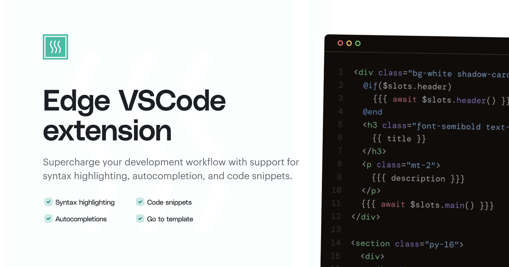

<div align="center">
  
</div>

<div align="center">
  <h2> Edge templates extension for VSCode </h2>
</div>

<br />
<hr />
<br />

This is the official extension for VSCode created by the creators of Edge.js. The extension adds support for the following features.

- Syntax highlighting for both HTML and Edge
- Code folding for Edge tags
- "Go To Template" in `.edge` and `.js/.ts` files
- Auto-completion for components and templates
- [Tags snippets](#tags-snippets)
- [Inbuilt helpers snippets](#inbuilt-helpers-snippets)
- [AdonisJS specific snippets](#adonisjs-specific-snippets)

> [!IMPORTANT]
> This extension does not perform code formatting.
>
> Code formatting with template engine syntax embedded inside HTML is tricky and needs dedicated resources to fight edge cases. We do not have the bandwidth to work on the same right now.

## Configuration

Following is the list of available configuration options :

### `edge.disks`

In order to benefit from autocompletion and Go-To links, the extension needs to know the directories hosting your Edge templates. 

That's what this option is for : it's an object whose keys are the disk names and values the paths to the template directories, relative to the root of your project.

By default, `edge.disk` has this value:

```json
{
  "edge.disks": {
    "default": "resources/views"
  }
}
```
This is perfectly suited to AdonisJS projects by default.

If you set up a secondary disk with Edge, like this
```ts
const BASE_URL = new URL('./', import.meta.url)
edge.mount('mydisk', new URL('my/sub/directory', BASE_URL))
```

You can configure the extension as follows:

```json
{
  "edge.disks": {
    "default": "resources/views",
    "mydisk": "my/sub/directory"
  }
}
```

---

If you are using packages such as `edge-uikit` or `@dimer/docs-theme` which add extra templates, you can configure new disks like this:

```json
{
  "edge.disks": {
    "default": "resources/views",
    "docs": "node_modules/dimerapp/docs-theme/build/templates",
    "ui": "node_modules/edge-uikit/build/views"
  }
}
```

### Emmet support

If you want to use Emmet in your Edge templates, you can add the following configuration:

```json
{
  "emmet.includeLanguages": {
    "edge": "html"
  }
}
```

## Tags snippets
Following is the list of available snippets

<table>
  <tr>
    <th width="150px"> Triggers </th>
    <th width="80%"> Output </th>
  </tr>
  <tr>
    <td>
      <code>if</code>
    </td>
    <td>
    <pre><code>@if(TAB_STOP_1)
  TAB_STOP_2
@end</code></pre>
    </td>
  </tr>
  <tr>
    <td>
      <code>elseif</code>
    </td>
    <td>
    <pre><code>@elseif(TAB_STOP_1)
  TAB_STOP_2
</code></pre>
    </td>
  </tr>
  <tr>
    <td>
      <code>else</code>
    </td>
    <td>
    <pre><code>@else
  TAB_STOP_1
</code></pre>
    </td>
  </tr>
  <tr>
    <td>
      <code>if-else</code>
    </td>
    <td>
    <pre><code>@if(TAB_STOP_1)
  TAB_STOP_2
@else
  TAB_STOP_3
@end
</code></pre>
    </td>
  </tr>
  <tr>
    <td>
      <code>unless</code>
    </td>
    <td>
    <pre><code>@unless(TAB_STOP_1)
  TAB_STOP_2
@end
</code></pre>
    </td>
  </tr>
  <tr>
    <td>
      <code>each</code>
    </td>
    <td>
    <pre><code>@each(TAB_STOP_1 in TAB_STOP_2)
  TAB_STOP_3
@end
</code></pre>
    </td>
  </tr>
  <tr>
    <td>
      <code>each-index</code>
    </td>
    <td>
    <pre><code>@each((TAB_STOP_1, TAB_STOP_2) in TAB_STOP_3)
  TAB_STOP_4
@end
</code></pre>
    </td>
  </tr>
  <tr>
    <td>
      <code>component</code>
    </td>
    <td>
    <pre><code>@component('components/')
  TAB_STOP
@end
</code></pre>
    </td>
  </tr>
  <tr>
    <td>
      <code>component-inline</code>
    </td>
    <td>
    <pre><code>@!component('components/')</code></pre>
    </td>
  </tr>
  <tr>
    <td>
      <code>slot</code>
    </td>
    <td>
    <pre><code>@slot('TAB_STOP_1')
  TAB_STOP_2
@end
</code></pre>
    </td>
  </tr>
  <tr>
    <td>
      <code>inject</code>
    </td>
    <td>
    <pre><code>@inject(TAB_STOP_1)</code></pre>
    </td>
  </tr>
  <tr>
    <td>
      <code>eval</code>
    </td>
    <td>
    <pre><code>@eval(TAB_STOP_1)</code></pre>
    </td>
  </tr>
  <tr>
    <td>
      <code>newError</code>
    </td>
    <td>
    <pre><code>@newError(
  'TAB_STOP_1',
  &dollar;caller.filename,
  &dollar;caller.line,
  &dollar;caller.col
)</code></pre>
    </td>
  </tr>
  <tr>
    <td>
      <code>include</code>
    </td>
    <td>
    <pre><code>@include('partials/')</code></pre>
    </td>
  </tr>
  <tr>
    <td>
      <code>include-if</code>
    </td>
    <td>
    <pre><code>@includeIf(TAB_STOP_1, 'partials/')</code></pre>
    </td>
  </tr>
  <tr>
    <td>
      <code>svg</code>
    </td>
    <td>
    <pre><code>@svg('TAB_STOP_1')</code></pre>
    </td>
  </tr>
  <tr>
    <td>
      <code>debugger</code>
    </td>
    <td>
    <pre><code>@debugger</code></pre>
    </td>
  </tr>
  <tr>
    <td>
      <code>let</code>
    </td>
    <td>
    <pre><code>@let(TAB_STOP_1 = 'TAB_STOP_2')</code></pre>
    </td>
  </tr>
  <tr>
    <td>
      <code>assign</code>
    </td>
    <td>
    <pre><code>@assign(TAB_STOP_1 = 'TAB_STOP_2')</code></pre>
    </td>
  </tr>
  <tr>
    <td>
      <code>vite</code>
    </td>
    <td>
    <pre><code>@vite('TAB_STOP_1')<code></pre>
    </td>
  </tr>
</table>

## Inbuilt helpers snippets

<table>
  <tr>
    <th width="150px"> Triggers </th>
    <th width="80%"> Output </th>
  </tr>
  <tr>
    <td>
      <code>props.toAttrs</code>
    </td>
    <td>
    <pre><code>&dollar;props.toAttrs()</code></pre>
    </td>
  </tr>
  <tr>
    <td>
      <code>props.merge</code>
    </td>
    <td>
    <pre><code>&dollar;props
  .merge({ TAB_STOP_1 })
  .toAttrs()</code></pre>
    </td>
  </tr>
  <tr>
    <td>
      <code>props.only</code>
    </td>
    <td>
    <pre><code>&dollar;props
  .only(['TAB_STOP_1'])
  .toAttrs()</code></pre>
    </td>
  </tr>
  <tr>
    <td>
      <code>props.except</code>
    </td>
    <td>
    <pre><code>&dollar;props
  .except(['TAB_STOP_1'])
  .toAttrs()</code></pre>
    </td>
  </tr>
  <tr>
    <td>
      <code>slots</code>
    </td>
    <td>
    <pre><code>await &dollar;slots.TAB_STOP_1</code></pre>
    </td>
  </tr>
  <tr>
    <td>
      <code>filename</code>
    </td>
    <td>
    <pre><code>&dollar;filename</code></pre>
    </td>
  </tr>
  <tr>
    <td>
      <code>caller</code>
    </td>
    <td>
    <pre><code>&dollar;caller.filename</code></pre>
    <pre><code>&dollar;caller.line</code></pre>
    <pre><code>&dollar;caller.col</code></pre>
    </td>
  </tr>
  <tr>
    <td>
      <code>nl2br</code>
    </td>
    <td>
    <pre><code>nl2br(html.escape(TAB_STOP))</code></pre>
    </td>
  </tr>
  <tr>
    <td>
      <code>inspect</code>
    </td>
    <td>
    <pre><code>inspect(TAB_STOP_1)</code></pre>
    </td>
  </tr>
  <tr>
    <td>
      <code>truncate</code>
    </td>
    <td>
    <pre><code>truncate(TAB_STOP_1, TAB_STOP_2)</code></pre>
    </td>
  </tr>
  <tr>
    <td>
      <code>excerpt</code>
    </td>
    <td>
    <pre><code>excerpt(TAB_STOP_1, TAB_STOP_2)</code></pre>
    </td>
  </tr>
  <tr>
    <td>
      <code>html</code>
    </td>
    <td>
    <pre><code>html.escape(TAB_STOP)</code></pre>
    <pre><code>html.safe(TAB_STOP)</code></pre>
    <pre><code>html.classNames(TAB_STOP)</code></pre>
    <pre><code>html.attrs(TAB_STOP)</code></pre>
    </td>
  </tr>
  <tr>
    <td>
      <code>stringify</code>
    </td>
    <td>
    <pre><code>js.stringify(TAB_STOP_1)</code></pre>
    </td>
  </tr>
  <tr>
    <td>
      <code>camelCase</code>
    </td>
    <td>
    <pre><code>camelCase(TAB_STOP_1)</code></pre>
    </td>
  </tr>
  <tr>
  <td>snakeCase</td>
  <td>
    <pre><code>snakeCase(TAB_STOP_1)</code></pre>
  </td>
</tr>

<tr>
  <td>dashCase</td>
  <td>
    <pre><code>dashCase(TAB_STOP_1)</code></pre>
  </td>
</tr>

<tr>
  <td>pascalCase</td>
  <td>
    <pre><code>pascalCase(TAB_STOP_1)</code></pre>
  </td>
</tr>

<tr>
  <td>capitalCase</td>
  <td>
    <pre><code>capitalCase(TAB_STOP_1)</code></pre>
  </td>
</tr>

<tr>
  <td>capitalCase</td>
  <td>
    <pre><code>capitalCase(TAB_STOP_1)</code></pre>
  </td>
</tr>

<tr>
  <td>sentenceCase</td>
  <td>
    <pre><code>sentenceCase(TAB_STOP_1)</code></pre>
  </td>
</tr>

<tr>
  <td>dotCase</td>
  <td>
    <pre><code>dotCase(TAB_STOP_1)</code></pre>
  </td>
</tr>

<tr>
  <td>noCase</td>
  <td>
    <pre><code>noCase(TAB_STOP_1)</code></pre>
  </td>
</tr>

<tr>
  <td>titleCase</td>
  <td>
    <pre><code>titleCase(TAB_STOP_1)</code></pre>
  </td>
</tr>

<tr>
  <td>pluralize</td>
  <td>
    <pre><code>pluralize(TAB_STOP_1)</code></pre>
  </td>
</tr>

<tr>
  <td>sentence</td>
  <td>
    <pre><code>sentence(TAB_STOP_1)</code></pre>
  </td>
</tr>

<tr>
  <td>prettyMs</td>
  <td>
    <pre><code>prettyMs(TAB_STOP_1)</code></pre>
  </td>
</tr>

<tr>
  <td>toMs</td>
  <td>
    <pre><code>toMs(TAB_STOP_1)</code></pre>
  </td>
</tr>

<tr>
  <td>prettyBytes</td>
  <td>
    <pre><code>prettyBytes(TAB_STOP_1)</code></pre>
  </td>
</tr>

<tr>
  <td>toBytes</td>
  <td>
    <pre><code>toBytes(TAB_STOP_1)</code></pre>
  </td>
</tr>

  <td>ordinal</td>
  <td>
    <pre><code>ordinal(TAB_STOP_1)</code></pre>
  </td>
<tr>
</tr>
</table>

## AdonisJS-specific snippets

<table>
  <tr>
    <th width="150px"> Triggers </th>
    <th width="80%"> Output </th>
  </tr>
  <tr>
    <td>
      <code>route</code>
    </td>
    <td>
    <pre><code>route('TAB_STOP_1', [TAB_STOP_2])</code></pre>
    </td>
  </tr>
  <tr>
    <td>
      <code>signedRoute</code>
    </td>
    <td>
    <pre><code>signedRoute('TAB_STOP_1', [TAB_STOP_2])</code></pre>
    </td>
  </tr>
  <tr>
    <td>
      <code>flashMessages</code>
    </td>
    <td>
    <pre><code>flashMessages.has(TAB_STOP)</code></pre>
    <pre><code>flashMessages.get(TAB_STOP)</code></pre>
    </td>
  </tr>
  <tr>
    <td>
      <code>asset</code>
    </td>
    <td>
    <pre><code>asset('TAB_STOP_1')</code></pre>
    </td>
  </tr>
  <tr>
    <td>
      <code>csrfField</code>
    </td>
    <td>
    <pre><code>csrfField()</code></pre>
    </td>
  </tr>
  <tr>
    <td>
      <code>cspNonce</code>
    </td>
    <td>
    <pre><code>cspNonce()</code></pre>
    </td>
  </tr>
  <tr>
    <td>
      <code>auth</code>
    </td>
    <td>
    <pre><code>auth.user</code></pre>
    <pre><code>auth.isAuthenticated</code></pre>
    </td>
  </tr>
  <tr>
    <td>
      <code>config</code>
    </td>
    <td>
    <pre><code>config('TAB_STOP_1')</code></pre>
    </td>
  </tr>
  <tr>
    <td>
      <code>t</code>
    </td>
    <td>
    <pre><code>t('TAB_STOP_1', { TAB_STOP_2 })</code></pre>
    </td>
  </tr>
</table>
