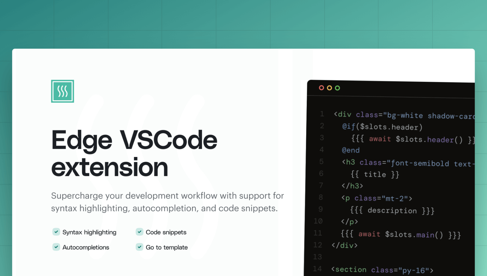

<div align="center">
  
</div>

<div align="center">
  <h2> Edge templates extension for VSCode </h2>
</div>

<br />
<hr />
<br />

This is the official extension for VSCode created by the creators of Edge.js. The extension adds support for following features.

- Syntax highlighting for both HTML and Edge
- [Tags snippets](#tags-snippets)
- [Inbuilt helpers snippets](#inbuilt-helpers-snippets)
- [AdonisJS specific snippets](#adonisjs-specific-snippets)

## Tags snippets
Following is the list of available snippets

### If
- `if`, `eif`

```edge

```

### Else if


### Else


### If Else


### Unless


### Each


### Each with index


### Component


### Inline component


### Component slot


### Inject


### Eval


### New error


### Include


### Conditional Include


### Svg


### Debugger


### Let


### Assign


### Vite

## Inbuilt helpers snippets

## AdonisJS specific snippets
